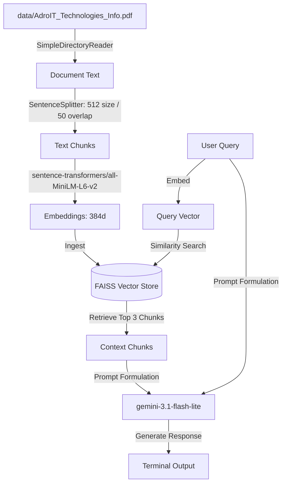

# Weekend Hack: PDF RAG Chatbot

A terminal-based Retrieval-Augmented Generation (RAG) chatbot built in Python. Load any PDF, embed it locally, and chat with it using Google Gemini as the language model.

Built as a first RAG implementation to understand the full pipeline: ingestion, chunking, embedding, vector search, and generation.

I specifically set it up to read a PDF about **AdroIT Technologies** (an IT training company), index it using a local FAISS database, and generate answers using the Google Gemini API.

## How it works (under the hood)
1. **Document Loading:** Reads `data/.pdf` using LlamaIndex's directory reader.
2. **Text Chunking:** Splits the document pages into small, overlapping chunks (512 tokens size, 50 tokens overlap) so the AI gets the right context.
3. **Local Vector Embeddings:** Uses the open-source `sentence-transformers/all-MiniLM-L6-v2` model to generate 384-dimensional vector representations of our text.
4. **FAISS Vector Store:** Stores these vectors in a local flat Index (`faiss-cpu`) to do quick similarity searches and pull the top 3 matches for our query.
5. **Generation (LLM):** Sends the matches along with our question to Google's `gemini-3.1-flash-lite` model to write a nice response.

---

## System Architecture

The following diagram illustrates the flow of data through the RAG pipeline, from ingestion to generation:



---

## Quick Start (How to Run it)

1. **Install requirements:**
   Install dependencies globally using pip:
   ```bash
   pip install -r requirements.txt
   ```

2. **Configure your API Key:**
   Get a free Gemini API key from Google AI Studio. Create a `.env` file in the root directory and put it in:
   ```env
   GEMINI_API_KEY=your_key_here
   ```

3. **Start the chat:**
   ```bash
   python chatbot.py
   ```
   To stop chatting, just type `exit` or `quit`.

---

## Tech Stack
- **LlamaIndex** (RAG Framework)
- **FAISS (faiss-cpu)** (Vector Search Library)
- **Sentence-Transformers** (Open-source Embedding Model)
- **Google Gemini API** (Large Language Model)
- **python-dotenv** (For reading configuration keys)

---

## What I Learned

This project covers the full RAG loop end to end. The key insight is that the LLM does not answer from its training data. It answers from your document. The quality of the answer depends on how well the retrieval finds the right chunks, not just how good the LLM is. Chunking strategy and embedding model choice directly affect retrieval quality.
