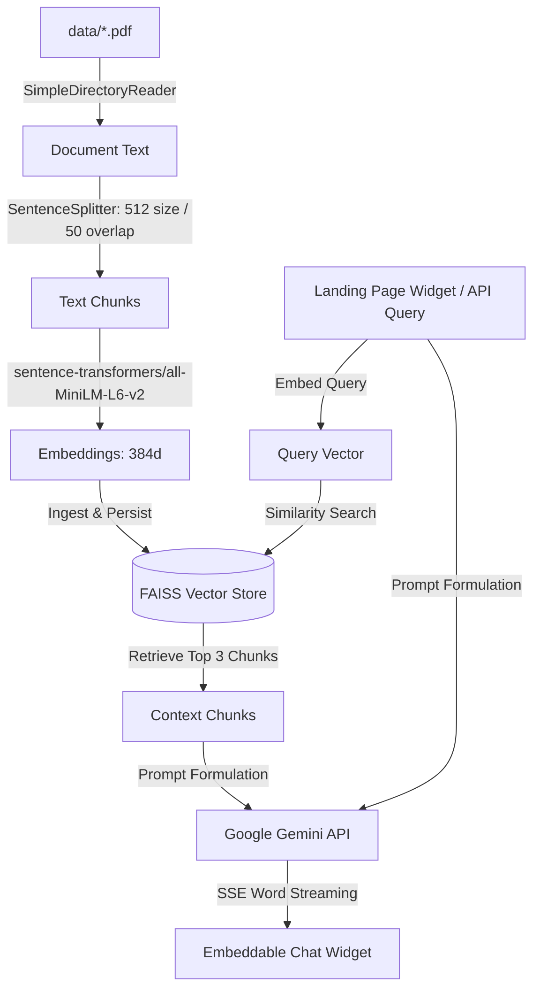

# PDF RAG Chatbot Service

A modular Retrieval-Augmented Generation (RAG) backend service and embeddable chat widget designed for website landing pages. Load any PDF document, index it using a local FAISS vector database, and chat with it in real-time via Google Gemini.

---

## System Architecture

The following diagram illustrates the end-to-end RAG pipeline, from document ingestion to real-time token streaming in the landing page widget:



---

## Implementation Pipeline

1. **Document Loading**: Reads PDF documents from `data/` using LlamaIndex directory reader.
2. **Text Chunking**: Splits document pages into overlapping segments (512 token size, 50 token overlap) to preserve contextual boundaries.
3. **Local Vector Embeddings**: Uses `sentence-transformers/all-MiniLM-L6-v2` to generate 384-dimensional dense vector embeddings locally without third-party embedding API costs.
4. **FAISS Vector Index**: Stores and searches vectors via a local flat Index (`faiss-cpu`), performing similarity search to retrieve the top 3 most relevant context chunks.
5. **Caching & Rebuild Detection**: Tracks document checksums in `storage/indexed_files.json`. Skips embedding on startup if files have not changed, enabling sub-second server boot times.
6. **Generation & SSE Streaming**: Formulates a structured system prompt combining retrieved context and user query, queries `gemini-3.1-flash-lite`, and streams tokens word-by-word over Server-Sent Events (SSE).

---

## Core Features

- **Token Streaming (Server-Sent Events / SSE)**: Delivers answers word-by-word with instant time-to-first-token, eliminating waiting periods for users.
- **Interactive Starter Prompts (Pills)**: Clickable suggestion chips displayed on greeting for instant 1-click questions, auto-collapsing during active chat.
- **IP Rate Limiting**: Token-bucket rate limiting (15 requests per minute per IP address) powered by `slowapi` to protect API quotas against abuse.
- **Health & Readiness Probes**: Comprehensive `/api/health` endpoint returning vector store status, doc count, and readiness status for load balancers.
- **Embeddable Chat Widget**: Drop-in vanilla JS widget (zero external dependencies) and React component for landing page integration.

---

## Directory Structure

```text
├── core/
│   ├── config.py         # App configuration, constants, prompts
│   └── rag.py            # FAISS vector store, streaming pipeline, health checks
├── api/
│   └── routes.py         # FastAPI endpoints, rate limiting, and SSE streaming
├── widget/
│   ├── chat-widget.js    # Embeddable vanilla JS chat widget (SSE streaming + pills)
│   ├── chat-widget.css   # Widget styling & responsive pill buttons
│   ├── ChatWidget.jsx    # React component version (SSE streaming + pills)
│   └── demo.html         # Landing page integration demo
├── data/                 # PDF knowledge base documents
├── storage/              # Cached FAISS index and metadata
├── app.py                # Main FastAPI entry point and static mounter
├── requirements.txt      # Python dependencies
├── .env.example          # Environment variables template
└── README.md
```

---

## Quick Start

### 1. Install Dependencies
```bash
pip install -r requirements.txt
```

### 2. Configure Environment
Create a `.env` file in the root directory:
```env
GEMINI_API_KEY=your_gemini_api_key_here
CORS_ORIGINS=*
```

### 3. Launch Server
```bash
uvicorn app:app --host 0.0.0.0 --port 8000 --reload
```
Interactive API documentation is accessible at `http://localhost:8000/docs`.

---

## Landing Page Integration

### Option 1: Script Embed (HTML / Any Website)
Include the stylesheet in `<head>` and the script before `</body>`:

```html
<link rel="stylesheet" href="http://localhost:8000/widget/chat-widget.css">

<script src="http://localhost:8000/widget/chat-widget.js" data-api-url="http://localhost:8000"></script>
```

### Option 2: React Component (React / Next.js / Vite)
Import `widget/ChatWidget.jsx` into your layout:

```jsx
import ChatWidget from './components/ChatWidget';

function App() {
  return (
    <div className="landing-page">
      <ChatWidget apiUrl="http://localhost:8000" />
    </div>
  );
}
```

### Preview Demo
With the server running, visit `http://localhost:8000/widget/demo.html` in your browser to test the interactive widget embedded in a landing page.

---

## API Endpoints

### 1. Health & Readiness Probe
- **Endpoint:** `GET /api/health`
- **Response (HTTP 200 / 503):**
  ```json
  {
    "status": "healthy",
    "ready": true,
    "vector_store": "ready",
    "gemini_configured": true,
    "indexed_documents": 1
  }
  ```

### 2. Token Streaming Chat (Recommended)
- **Endpoint:** `POST /api/chat/stream`
- **Rate Limit:** 15 requests / minute / IP
- **Request Body:**
  ```json
  {
    "question": "What courses and skill levels do you offer?"
  }
  ```
- **Response (`text/event-stream`):**
  ```text
  data: {"token": "We "}

  data: {"token": "offer "}

  data: [DONE]
  ```

### 3. Synchronous Chat
- **Endpoint:** `POST /api/chat`
- **Rate Limit:** 15 requests / minute / IP
- **Request Body:**
  ```json
  {
    "question": "What services do you provide?"
  }
  ```
- **Response:**
  ```json
  {
    "answer": "We provide specialized training programs, certifications, and technical consulting."
  }
  ```

---

## Updating the Knowledge Base

1. Place updated or new PDF files into the `data/` directory.
2. The service automatically detects changes in `data/` and rebuilds the FAISS vector index in `storage/` on the next server start or query.
